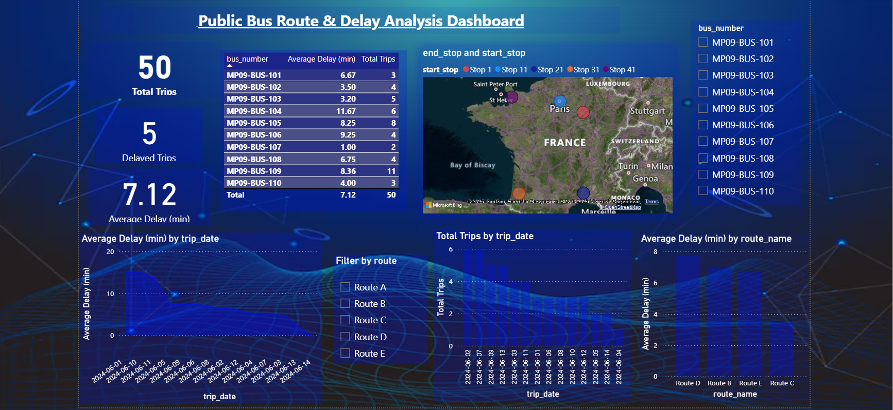

# Bus_Route_Analysis_Project_
End-to-end SQL + Power BI project analyzing public bus routes, trip delays, and fleet performance using MySQL &amp; interactive dashboard

## 📌 Objective
This project explores how SQL and Power BI can improve public transport efficiency by:
- Tracking **average delay**, **delayed trip percentage**, and **route/bus performance**
- Detecting buses or routes that consistently run late
- Presenting an **interactive dashboard** for managers to make data-driven adjustments

## 🗂 Data
- **Trip Logs**  
- **Routes**
- **Buses**  

## 🛠 Tools & Skills
- **SQL (MySQL)** – data cleaning, joins, aggregations
- **Power BI** – DAX measures, KPI cards, slicers, bar/line charts, map visual
- **Data Modeling** – one-to-many relation between `trip_logs` and `routes`

## 📊 Dashboard Preview

> KPI cards show total trips, delayed trips, and fleet average delay. Visuals include route-wise delays, bus-wise performance, date trends, and a geo map of stops.

## 📈 Key Findings
- **Fleet Average Delay:** ~7.1 minutes (~10 % of trips delayed >15 minutes)
- **Top Delay Bus:** MP09-BUS-104 (~11.7 min), highest in the fleet
- **Route Performance:** Route D (~7.8 min) slightly higher than Route B (~7 min) and Route E (~6.8 min)
- **Improvement Opportunity:** Build hour-of-day & weekday trends to confirm peak windows before shifting timetables

## 💡 Recommendations
- Focus timetable review on **Route D** (highest current average delay ~7.8 min)
- Inspect & maintain **MP09-BUS-104**; review driver shift & route logs
- Configure **Power BI alerts**:
  - Fleet average delay >10 min
  - Any route/bus >20 % delayed trips
- Add an **hour-of-day / weekday** page to validate peak hours and guide schedule tuning

## 📁 Repository Structure
Bus-Delay-Analysis/
├─ README.md
│ └─ BusDelay.pdf
└─ dashboard/
└─ BusDelay.pbix 

📧 Author
Ourusa Ali
aliourusa@gmail.com
